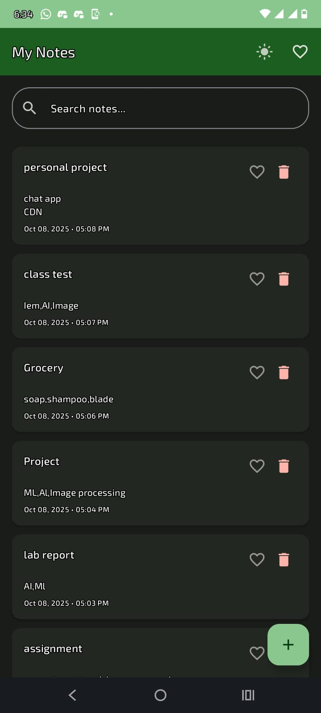
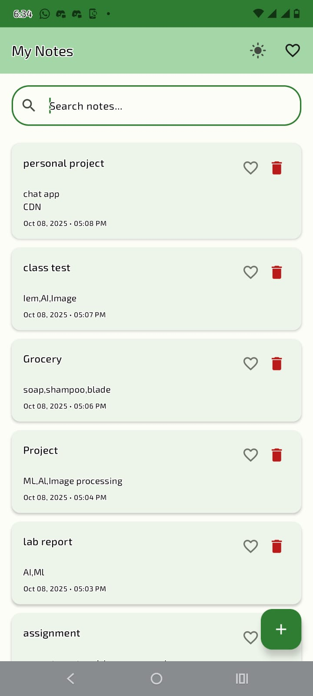
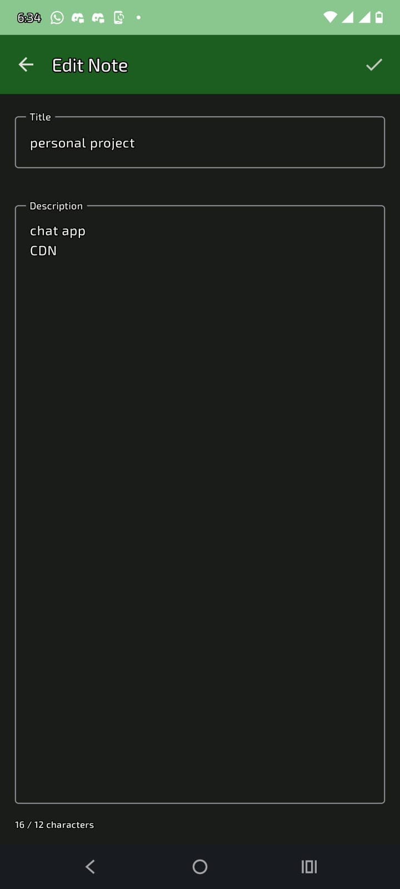

# Note-Taking Android App

A modern, clean, and fully functional note-taking app for Android built with Jetpack Compose, Room, and MVVM architecture. Easily create, edit, search, and organize your notes with support for dark/light themes and favorite notes.

## Features
- Add, edit, and delete notes
- Mark notes as favorite
- Search notes by title or description
- Filter notes to show only favorites
- Responsive UI with Jetpack Compose
- Persistent storage using Room database
- MVVM architecture for clean separation of concerns
- Theme switching: Light, Dark, and System Default

## Screenshots





## Getting Started

### Prerequisites
- Android Studio Hedgehog or newer
- Android device or emulator (API 24+ recommended)

### Build & Run
1. Clone the repository:
   ```sh
   git clone https://github.com/tahmid-100/note-taking-android-app.git
   ```
2. Open the project in Android Studio.
3. Sync Gradle and build the project.
4. Run the app on your device or emulator.

## Project Structure
```
app/
  src/
    main/
      java/com/example/noteapp/
        data/local/         # Room entities, DAO, database, theme preferences
        data/repository/    # Repository for data operations
        ui/screens/         # Composable screens (Home, Add/Edit)
        ui/navigation/      # Navigation graph
        ui/theme/           # Theme setup
        ui/viewmodel/       # ViewModel and factory
      res/                  # Resources (icons, colors, etc.)
    test/                   # Unit tests
build.gradle.kts            # Project build config
README.md                   # Project documentation
```

## Main Components
- **Room Database**: Stores notes locally.
- **Repository**: Handles data operations and abstracts Room.
- **ViewModel**: Manages UI state and business logic.
- **Jetpack Compose**: UI toolkit for building native interfaces.
- **Navigation**: Manages screen transitions.
- **ThemePreferences**: Persists theme settings using DataStore.

## How It Works
- **Home Screen**: View, search, and filter notes. Access theme settings and add new notes.
- **Add/Edit Screen**: Create or update notes. Title is required.
- **Favorites**: Mark notes as favorite for quick access.
- **Theme Switching**: Choose between light, dark, or system theme.

## Customization
- Update colors, icons, and layouts in `ui/theme` and `res`.
- Extend note features (e.g., add images, reminders) by updating Room entities and UI.

## Contributing
Pull requests are welcome! For major changes, please open an issue first to discuss what you would like to change.

## Contact
For questions or feedback, open an issue or contact [tahmidalam8765@gmail.com].

---


